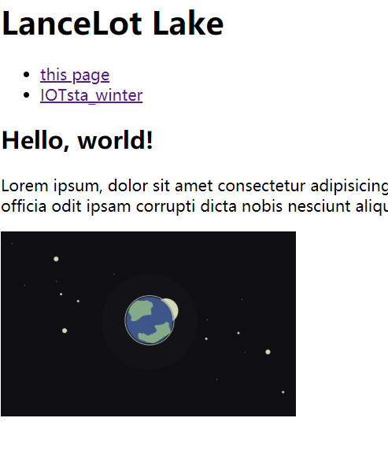
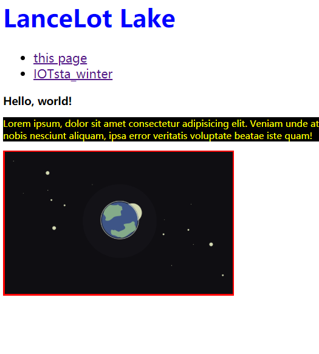

# HTML 和 CSS 基础
面向零基础的同学，如果您已经有一定的基础，可以跳过前面你觉得确认已经掌握的内容。

### start
## Day1
#### 1 任务描述
创建一个HTML文件，比如task01.html文件，在里面实现一些代码，完成你的第一个网页。

这个页面中，需要有以下内容：
+ 一个一级标题，内容是你的昵称或者姓名
+ 一个无序列表，包括两个项目，每一个项目是一个链接，分别链接到task0001.html以及你的微博（或其他什么网站）
+ 一个二级标题，内容随意（不能违法、色情、反党反人类等）
+ 一个段落，内容随意（要求同上）
+ 一个图片，内容随意（要求同上）

最后效果图如下：

#### 2 期望达成
+ 了解什么是Web
+ 了解什么是HTML
+ 了解一些基本的HTML语法及标签
+ 能够写出自己的第一个HTML

#### 3 参考资料
+ [知乎上的一些Web基本概念介绍](http://www.zhihu.com/question/22689579)
+ [慕课网HTML+CSS基础课程](http://www.imooc.com/learn/9)
+ [w3school的html教程](http://w3school.com.cn/html/index.asp)
+ [MDN HTML](https://developer.mozilla.org/zh-CN/docs/Web/HTML/Introduction)

## Day2
#### 1 任务描述
学习以下CSS是怎么运作的，然后创建一个task01.css的文件，并在task01.html中引入它，然后我们对task01.html做一些让他变得花哨一点的事情：

+ 让一级标题的文字颜色变成蓝色
+ 二级标题的文字大小变成14px
+ 段落的文字大小变成12px，文字颜色是黄色，带一个黑色的背景色
+ 图片有一个红色的，2px粗的边框

最后效果图如下：

#### 2 期望达成
+ 了解什么是CSS
+ 了解HTML与CSS是如何一起工作的
+ 了解基本的CSS语法
+ 尝试使用几个简单的CSS属性

#### 3 参考资料
+ [MDN CSS](https://developer.mozilla.org/zh-CN/docs/Web/Guide/CSS/Getting_started)的1，2，3节
+ [慕课网HTML+CSS基础课程](http://www.imooc.com/learn/9)
+ [w3school css](http://w3school.com.cn/css/index.asp)

## Day3
#### 1 任务描述
了解一下HTML及CSS的发展史，了解一下HTML4到5究竟变化了什么

#### 2 期望达成
+ 对于HTML及CSS的发展史有一个大概的了解
+ 明白HTML5和之前的版本大概有什么区别

#### 3 参考资料
+ [MDN HTML](https://developer.mozilla.org/zh-CN/docs/Web/HTML/Introduction)
+ [MDN CSS](https://developer.mozilla.org/zh-CN/docs/Web/Guide/CSS/Getting_started)
+ [W3C: HTML5, Differences from HTML4](http://www.w3.org/TR/html5-diff/)
+ [w3school](http://w3school.com.cn/html5/index.asp)

## Day4
#### 1 任务描述
接下来我们深入学习HTML、CSS，首先深入了解CSS的各种选择器、继承、层叠、样式优先级机制。

#### 2 期望达成
+ 掌握CSS各种选择器
+ 掌握CSS的继承、层叠、样式优先级机制

#### 3 参考资料
+ [MDN CSS](https://developer.mozilla.org/zh-CN/docs/Web/Guide/CSS/Getting_started)的4、5节
+ [w3school css](http://w3school.com.cn/css/index.asp)

## Day5
#### 1 任务描述
在你的`task0001.html`中，快速实践以下文本相关的所有属性内容：

+ 实现一个背景色为红色、宽度为960px的
在浏览器中居中
+ 有的圆角矩形是复杂图案，无法直接用border-radius，请在不使用border-radius的情况下实现一个可复用的高度和宽度都自适应的圆角矩形
+ 实现一个两列布局，其中左侧部分宽度固定、右侧部分宽度随浏览器宽度的变化而自适应变化
+ 实现一个三列布局，其中左侧和右侧的部分宽度固定，中间部分宽度随浏览器宽度的变化而自适应变化
+ 实现一个浮动布局，红色容器中每一行的蓝色容器数量随着浏览器宽度的变化而变化

#### 2 期望达成
+ 掌握文本、文字、链接相关的样式属性
+ 掌握背景属性
+ 掌握列表相关的样式属性
+ 深入了解行高属性

#### 3 参考资料
+ [MDN CSS](https://developer.mozilla.org/zh-CN/docs/Web/Guide/CSS/Getting_started)
+ [w3school css](http://w3school.com.cn/css/index.asp)
+ [深入了解行高属性](http://www.cnblogs.com/fengzheng126/archive/2012/05/18/2507632.html)

## Day6
#### 1 任务描述
盒模型及定位。在task0001.html中，实践以下内容：

#### 2 期望达成
+ 掌握块状元素、内联元素、和内联块状元素的概念与区别
+ 掌握盒模型的所有概念，学会如何计算各种盒模型相关的数值
+ 掌握position的相关知识
+ 掌握float的相关知识
+ 掌握基本的布局方式
+ 了解Grid、Flexbox等布局方式

#### 3 参考资料
+ [MDN](https://developer.mozilla.org/zh-CN/docs/CSS/%E5%BC%80%E5%A7%8B/Boxes)
+ [w3school](http://w3school.com.cn/css/css_boxmodel.asp)
+ [慕课网](http://www.imooc.com/code/2047)
+ [学习CSS布局](http://zh.learnlayout.com/no-layout.html)
+ [CSS布局方式](http://teamtreehouse.com/library/css-layout-techniques)
+ [双飞翼布局介绍-始于淘宝UED](http://www.imooc.com/wenda/detail/254035)
+ [W3C Visual formatting model](http://www.w3.org/TR/CSS21/visuren.html#)
+ [MDN Visual formatting model](https://developer.mozilla.org/en-US/docs/Web/Guide/CSS/Visual_formatting_model)
+ [CSS 101: Block Formatting Context](http://www.yuiblog.com/blog/2010/05/19/css-101-block-formatting-contexts)
+ [Block Formatting Context In CSS](http://outofmemory.cn/wr/?u=http%3A%2F%2Fkkeys.me%2Fpost%2F68547473290)
+ [A new micro clearfix hack](http://nicolasgallagher.com/micro-clearfix-hack/)
+ [那些年我们一起清除过的浮动 by 一丝冰凉](http://www.iyunlu.com/view/css-xhtml/55.html)
+ [BFC和hasLayout](http://www.cnblogs.com/pigtail/archive/2013/01/23/2871627.html)

